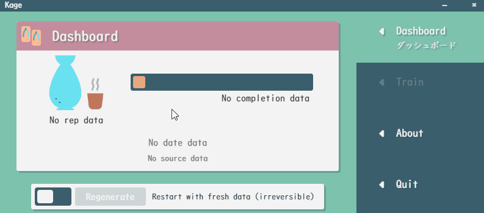
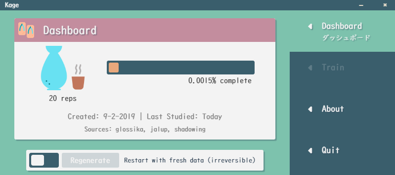
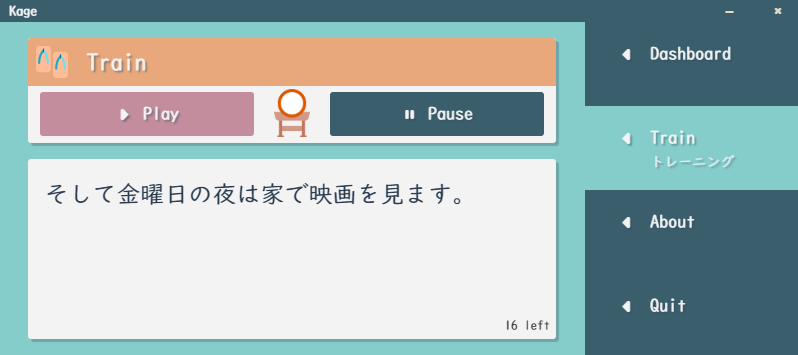
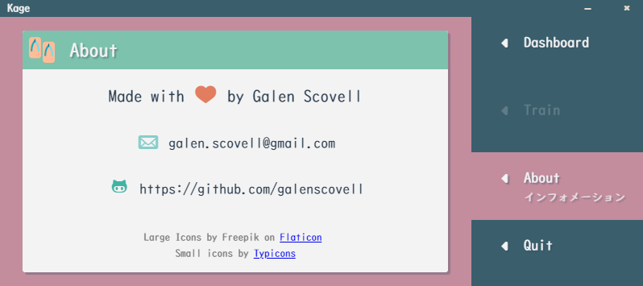

# Kage

After struggling to find a language learning tool focused on listening/speaking, I decided to just make my own.

Kage is a simple tool that takes in audio clips from any source, assembles them into sets, and presents them to you in a manner similar to Glossika using spaced repetition.

### Importing Data
* Organize data files into sub-directories in the `root-dir/resources/app/app/data` directory. Each of these will be considered a separate 'source'.
    * Entries from each source will be assembled into packs round-robin style later.
* In each sub-directory, there should be no other directories. They can have any number of mp3 files and exactly one CSV file.
    * The CSV file format is simple, see sample CSV and source in the `root-dir/resources/app/app/data` directory
    * Each CSV row should be two columns: the name of the file (without extension), and the text to display for that entry.
    * The CSV is not required for each sub-directory. If not found it will be silently ignored, but there will be no text presented alongside audio.

### Usage
* Import and generate your audio/text data, then proceed to the Training tab to begin a session.
* A session will be composed of your audio files broken up into packs, then repeated several times in random order.
* During the session, shadow each entry's audio out loud. Only one session may be done per day.
* Sessions will grow progressively longer, covering both new packs and the past few days for more repetition.
    * Lesson format for first 6 days:
             
             n-4, n-3, n-2, n-1, n
    
             -  -  -  -  1
             -  -  -  1  2
             -  -  1  2  3
             -  1  2  3  4
             1  2  3  4  5
             2  3  4  5  6
    * A session will never grow larger than 5 packs.
